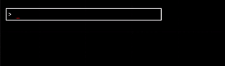

# advanced go: console autocomplete

[In the last article](https://eblog.fly.dev/console.html) we built a fully-featured debug console that allowed live editing of a program's state. But you can't spell complete without auto-complete! Well, you can, but it's more typing.

## Autocomplete



Autocomplete is an essential feature for a console. Above and beyond the fact that it saves typing, autocomplete

- cuts down on mistakes by guiding you to correct spellings and syntax
- allows the user to recognize when they've completed a command
- makes the console 'discoverable' by showing the user what commands are available as they type

Let's briefly review the syntax of our console commands.

To quote the last article:

> Commands will be of the form: `OP arg1 arg2 ... argN`, but we'll also allow the form `arg1 AUGOP arg2`, which is equivalent to `mod arg1 AUGOP arg2`. (That is, `mod` is implied as the opcode.)

| ITEM      | description                            | example                     |
| --------- | -------------------------------------- | --------------------------- |
| `OPCODE`  | specifies a console command            | `watch`, `mod`, `cpin`      |
| `PATH`    | a path to a field of the game state.   | `player.hp`, `player.pos.x` |
| `AUGOP`   | an augmented assignment operator.      | `+=`, `*=`, `%=`            |
| `LITERAL` | a literal value, interpreted by the OP | `100`, `hello`              |

Our autocomplete will be based on the following rules:

- the FIRST word of a command is an `OPCODE` or `PATH`, opcodes taking precedence
- If the first word is an OPCODE, the rest of the words are `LITERAL`s or `PATH`s
- If the first word is a `PATH`, the second word must be an `AUGOP`, and the third word must be a `LITERAL` or `PATH`.

Assuming we have an interface that looks like this:

```go
// autocomplete returns the lexically first completion of p from candidates.
func autocomplete(candidates []string, p string) string{
// implementation in the next section
}
```

Generating completions would look pretty much like this:

```go
func suggestCompletion(s string, paths, opcodes, augops []string) string {
    switch words := strings.Fields(s); len(words) {
    case 1:
        if completion := autocomplete(words[0], opcodes); completion != "" {
            return completion
        }
        return autocomplete(words[0], paths)
    case 2:
        // was the first word a path?
        if autocomplete(words[0], paths) != "" {
            if completion := autocomplete(words[1], augops); completion != "" {
                return words[0] + " " + completion
            }
            return ""
        }
        // nope; must have been an opcode (and if it wasn't, we still suggest paths)
        if completion := autocomplete(words[1], paths); completion != "" {
            return words[0] + " " + completion
        }
    default:
        last := len(words) - 1
        if words[last] = autocomplete(words[last], paths); words[last] != "" {
            return strings.Join(words, " ")
        }
        return ""
    }
}
```

But we don't _have_ an autocomplete function or list of candidates. And we don't even know if a flat slice of strings is the proper way to _store_ the candidates.

## data structures for autocomplete

Variants on the prefix tree (sometimes called [trie](https://en.wikipedia.org/wiki/Trie)) are the standard data structure for autocomplete. They offer fast `O(k)` lookup, where `k` is the length of the string being autocompleted and relatively quick insertion, and don't use much memory.

We don't need insertion, though, and prefix trees tend to fragment the actual strings being stored all over the heap. If all we need to do is _look up_ similar strings, a sorted slice will allow us to binary search for 'where the prefix would be inserted' instead.

That is, if we have a sorted slice of string candidates like this: `{"foo", "player", "player.hp", "player.pos", "player.pos.x", "player.pos.y"}`, and we want to autocomplete `player.p`, we can binary search for the first string that is _greater than_ `player.p`, which will be `"player.pos"`. Then we can check if that string starts with `player.p`, and if it does, we have our completion.

That is, our implementation of autocomplete will look like this:

```go
// autocomplete returns the lexically first completion of prefix from candidates.
func autocomplete(candidates []string, prefix string) string {
   // candidates are already sorted, so we can do a binary search
   i, ok := slices.BinarySearch(candidates, prefix)
   if ok { // the prefix IS a candidate
      return prefix
   }
   if i == len(candidates) { // the prefix is greater than all candidates
      return ""
   }
   if strings.HasPrefix(candidates[i], prefix) {
      return candidates[i]
   }
   // there's no match
   return ""
}
```

We'll sort our candidates exactly once when we initialize the console, and then we'll never have to sort them again. We'll also store them in a single slice, rather than a tree of slices, so we'll have better cache locality. (Actually, we have an _even better_ technique for cache locality, but that'll be a bonus at the end of the article.)

## generating completions

How do we generate our sorted slice of candidates? First, the opcodes and augmented operators are easy: we'll just hardcode them already sorted, using [sort.StringsAreSorted](https://pkg.go.dev/sort#StringsAreSorted) once at boot to make sure we didn't make a mistake.

```go
var opcodes = assertSorted("opcodes", []string{
    "cp",
    "cpin",
    "cpout",
    "exit",
    "help",
    "mod",
    "watch",
})
var augops = assertSorted("augmented assignment operators", []string{
    "-=",
    "*=",
    "/=",
    "%=",
    "+=",
})
func assertSorted(label string, s []string) []string {
    if !sort.StringsAreSorted(s) {
        panic(label + " not sorted")
    }
}
```

The paths are a little trickier. We'll need to walk the the game state type and generate all the paths, making sure not to expose invalid or unexported paths.

This section's going to involve a lot of reflection, so please check the cheat sheet in the previous article if you need a refresher.

### Autocomplete: path candidate generation: naive implementation

Just looking at struct fields, we could imagine a naive implementation like this:

```go
func BuildPathCompletions[T any]() []string {
    t := reflect.TypeOf((*T)(nil)).Elem()
    for t.Kind() == reflect.Ptr { // dereference pointers
        t = t.Elem()
    }
    switch t := reflect.TypeOf(T); t.Kind() {
        case reflect.Struct:
            // for each field, build completions for the field's type, and prepend the field name
            var paths []string
            for i := 0; i < t.NumField(); i++ {
                field := t.Field(i)
                if !field.IsExported() { // unexported; skip
                    continue
                }
                paths = append(paths, field.Name)
                if field.Type.Kind() == reflect.Struct {
                    fieldPaths := BuildPathCompletions(field.Type)
                    for _, p := range fieldPaths {
                        paths = append(paths, field.Name+"."+p)
                    }
                }
            }
        case reflect.Ptr, reflect.Slice, reflect.Array:
            // we'll handle these later
    }
}
```

### problems with the naive implementation

This seems pretty good at first glance, but it has a number of problems, even ignoring the fact that it doesn't handle pointers, slices, or arrays:

- Some structs contain pointers to themselves, or to other structs that contain pointers to themselves. the classic example is the singly linked list:

  ```go
      type Node[T any] struct {
          Val T
          Next *Node
      }
  ```

  But many other data structures have similar problems. We can handle this by keeping track of the types we've already seen, and not recursing into them again, or just by limiting the depth of recursion. (We'll do the latter, since it's simpler.)

- Embedded/Anonymous structs are a problem. If we have a struct like this:

  ```go
  type Pos struct { X, Y float64}?
  type Player struct { Pos}
  ```

  We expect both `player.x` and `player.pos.x` to be valid paths, but our naive implementation will only generate `player.pos.x`.

- Most importantly, the performance is _terrible_.

#### performance

Let's walk through the performance of our naive implementation. We'll assume that we have a struct like this:

```go
type Game struct { Player }
type Pos struct { X, Y float64}
type Player struct { Pos }
```

How is the field `player.pos.x` generated?

- we start with `BuildPathCompletions[Game]`,
- we recurse into `BuildPathCompletions[Player]`, which allocates a slice and calls `BuildPathCompletions[Pos]`
- which allocates a slice and returns `{"x", "y"}` to `BuildPathCompletions[Player]`
- which copies the slice and prepends `pos.` to each element, returning `{"pos.x", "pos.y"}` to `BuildPathCompletions[Game]`
- which copies the slice and prepends `player.` to each element, returning `{"player.pos.x", "player.pos.y"}` to the caller.
  so `player.pos.x` had to build three different strings, each of which was copied to a different slice. That's a lot of wasted work!

This is a perfect example of the kind of programming that seems perfectly reasonable and is hugely wasteful. It's not the kind of big-O stuff you go over in college; it's real, practical allocation and CPU time saved by thinking about how your program actually works.

### solving the problems with the naive implementation

We can handle all three of these problems by changing our API. (Actually, we'll have two APIs - one internal and one external - but we'll get to that.)

- Slice allocations:
  As Dave Cheney wisely noted in his 2019 article, [don't force allocations on the callers of your api](https://dave.cheney.net/2019/09/05/dont-force-allocations-on-the-callers-of-your-api). Instead of returning a slice, we'll take a slice as an argument and append to it, allowing us to reuse the same slice over and over again.
- Repeated prepends:
  Instead of _prepending_ the field name as we go up, we'll keep track of the field names as we go down, doing _appends_ instead. That way, each field name will be created in it's final form, and we won't have to copy it again.
- Embedded structs:
  We'll handle embedded structs by doing the work twice; once counting the anonymous struct as a field of the parent struct, and once counting the anonymous struct's fields as fields of the parent struct.

Our API will look like this:

```go
// appendCompletionPaths for the type and it's subfields (for structs) and elements (for arrays),
// continuing to recurse until we hit a non-struct, non-array type or MaxCompletionDepth.
func appendCompletionPaths(completions []string, t reflect.Type, prefix string, depth int) []string {
}
```

But we'll provide an outside-facing API that makes it easier to understand what's going on, without compromising (much) on performance:

```go
func BuildPathCompletions[T any]() []string {
    paths := appendCompletionPaths(nil, reflect.TypeOf((*T)(nil)).ELem(), "", 0)
    sort.Strings(paths)
    return paths
}
```

Let's implement `appendCompletionPaths`. See the previous article for a refresher on reflection and the definition of `normalize`.

```go

const MaxCompletionDepth = 8 // arbitrary limit to prevent infinite recursion for cyclic structs like linked lists.

// appendCompletionPaths for the type and it's subfields (for structs) and elements (for arrays),
// continuing to recurse until we hit a non-struct, non-array type or MaxCompletionDepth.
func appendCompletionPaths(completions []string, t reflect.Type, prefix string, depth int) []string {
   normalized := normalize(prefix)
   if len(completions) == 0 || completions[len(completions)-1] != normalized { // add this one if we haven't already
      completions = append(completions, normalized)
   }
   if depth > MaxCompletionDepth { // don't recurse any further
      return completions
   }
   for t.Kind() == reflect.Ptr { // dereference pointers
      t = t.Elem()
   }
   if t == ebitenImageType {       // readers can ignore this.

      // hacky nonsense: don't recurse into images since they break reflect.
      // I think they're handles to CGO,
      // so the go runtime doesn't know how to handle them.
      return completions
   }
   switch t.Kind() {
   case reflect.Struct:
      for i := 0; i < t.NumField(); i++ {
         f := t.Field(i)
         if !f.IsExported() { // unexported; skip
            continue
         }
         if prefix != "" && prefix[len(prefix)-1] != '.' { // add a dot if we need one; first field doesn't need one
            prefix += "."
         }
         /* --- design note: ---
         we handle embedded (anonymous) structs by doing the work twice;
         once counting the anonymous struct as a field of the parent struct, and once counting the anonymous struct's fields as fields of the parent struct.
         the design of our API made this step trivial; trying to keep track of which fields were anonymous and which weren't by hand would have been very difficult.
         */
         if f.Anonymous { // append the completions for all of the anonymous struct's subfields, accessed as if they were fields of the parent struct.
            completions = appendCompletionPaths(completions, f.Type, prefix, depth+1) // this will have some duplicates, but that's OK: we sort and dedupe later.
         }
         completions = appendCompletionPaths(completions, f.Type, prefix+t.Field(i).Name, depth+1)
      }
      return completions
   }
}
```

OK, that's structs settled. Arrays are pretty simple: since the length is part of the type, we know which elements are valid paths; we can just loop through them as though they were fields of a struct.

```go
   case reflect.Array:
      // generate completions for array indices, since we know how many there are:
      // we can even follow further into the array's type, if it's a struct or array itself.
      for i := 0; i < t.Len(); i++ {
         completions = appendCompletionPaths(completions, t.Elem(), fmt.Sprintf("%s.%d.", prefix, i), depth+1)
      }
      return completions
```

But what about slices? We don't know how many elements slices have. While it's certainly _possible_ to create some kind of dynamic autocomplete that queries the gamestate to find out the length of slices and suggest completions appropriately, this sounds wildly complicated. Instead, we'll just assume slices have ten elements (0..=9) and generate completions for those:

```go
   case reflect.Slice:
      // generate completions for array indices 0..9. we don't know exactly how many there are, and every additional completion adds memory overhead.
      // this is as far as I want to go w/out a more sophisticated solution.
      for i := 0; i < 9; i++ {
         completions = appendCompletionPaths(completions, t.Elem(), fmt.Sprintf("%s.%d.", prefix, i), depth+1)
      }
      return completions
```

There's no good solution for maps, at least as far as I can think of, so we'll just ignore them.

### the final implementation

That's all we need to generate the completions. The final implementation looks like this in Tactical Tapir itself:

```go
func BuildCompletions[T any]() []string {
   now := time.Now()
   t := typeOf[T]()
   completions := appendCompletionPaths(nil, t, "", 0)
   log.Printf("BuildCompletions[%s]: %s", t, time.Since(now))
   return sortedCleaned(completions)
}
```

```go
// appendCompletionPaths for the type and it's subfields (for structs) and elements (for arrays),
// continuing to recurse until we hit a non-struct, non-array type or MaxCompletionDepth.
func appendCompletionPaths(completions []string, t reflect.Type, prefix string, depth int) []string {
   normalized := normalize(prefix)
   if len(completions) == 0 || completions[len(completions)-1] != normalized { // add this one if we haven't already
      completions = append(completions, normalized)
   }
   if depth > MaxCompletionDepth { // don't recurse any further
      return completions
   }
   t = derefType(t)
   if t == ebitenImageType {
      // hacky nonsense: don't recurse into images since they break reflect.
      // I think they're handles to CGO,
      // so the go runtime doesn't know how to handle them
      return completions
   }
   switch t.Kind() {
   default:
      return completions // can't follow this type any further
   case reflect.Array:
      // generate completions for array indices, since we know how many there are:
      // we can even follow further into the array's type, if it's a struct or array itself.
      for i := 0; i < t.Len(); i++ {
         completions = appendCompletionPaths(completions, t.Elem(), fmt.Sprintf("%s.%d.", prefix, i), depth+1)
      }
      return completions
   case reflect.Slice:
      // generate completions for array indices 0..9. we don't know exactly how many there are, and every additional completion adds memory overhead.
      // this is as far as I want to go w/out a more sophisticated solution.
      for i := 0; i <= 9; i++ {
         completions = appendCompletionPaths(completions, t.Elem(), fmt.Sprintf("%s.%d.", prefix, i), depth+1)
      }
      return completions
   case reflect.Struct:
      for i := 0; i < t.NumField(); i++ {
         f := t.Field(i)
         if !f.IsExported() {
            continue
         }
         if prefix != "" && prefix[len(prefix)-1] != '.' {
            prefix += "."
         }
         if f.Anonymous { // append the completions for all of the anonymous struct's subfields, accessed as if they were fields of the parent struct.
            completions = appendCompletionPaths(completions, f.Type, prefix, depth+1) // this will have some duplicates, but that's OK: we sort and dedupe later.
         }
         completions = appendCompletionPaths(completions, f.Type, prefix+t.Field(i).Name, depth+1)
      }
      return completions
   }
}
```

### bonus: compacting the completions

But what the heck is `sortedCleaned`? Before I explain, let's take a step back and think about how we're going to use our completions. We need to do a binary search for a completion for every character the user types. That's a lot of binary searches! We can speed this up by making the completions as fast to search as possible.

Let's think a little bit about how the string comparisons behind `sort.BinarySearchStrings` actually work. A string header is a `ptr,len` pair, and the `ptr` points to the first byte of the string. So when we compare two strings, we're actually comparing two pointers, and then comparing the bytes at those pointers until we find a difference:

That is, `"foo" < "bar"` _actually_ compiles to something more or less like this:

```go
// compareStr compares two strings, returning -1 if a < b, 0 if a == b, and 1 if a > b.
func compareStr(a, b string) int {
   aLen, bLen := len(a), len(b)
   pa, pb := unsafe.StringData(a), unsafe.StringData(b)
   if pa == pb { // are they part of the same string?

   switch {
         case aLen < bLen: // yes, but a is shorter (and 'less')
            return -1
         case aLen > bLen: // yes, but a is longer (and 'greater')
            return 1
         default:
            return 0 // they're literally the same string
      }
   }
   n := min(aLen, bLen)
   for i := 0; i < n; i++ {
      ba, bb := *unsafe.Add(pa, i), *unsafe.Add(pb, i)
      switch {
         case ba < bb:
            return -1
         case ba > bb:
            return 1
         default:
            continue
      }
   }
   // they're the same up to the length of the shorter string, so the longer string is 'greater'
   switch {
      case aLen < bLen:
         return -1
      case aLen > bLen:
         return 1
      default:
         return 0
   }
}
```

This leads to a few interesting observations:

- if we have two strings that are "equal" but part of different allocations, this takes the longest to compare of any two strings; if they're literally the same string header, it takes the least time to compare.
- we can save memory by combining the allocations of strings that are equal, since they'll all point to the same buffer; we can also save memory by combining the allocations of strings that are prefixes of each other, since they'll share the same prefix. finding _all_ prefixes is difficult (well, without a trie; maybe we _should_ have done that, afterall). But finding trivial prefixes isn't too bad:

  ```go
  // reslice non-unique strings in a sorted slice as prefixes of the longer strings that follow them.
  // this can save some memory and improve cache locality.
  // don't do this unless you're sure you know what you're doing; the performance benefits are not usually worth the added complexity,
  // and there's no guarantee you'll save anything at all.
  func resliceSorted(a []string) []string {
     for i := 0; i < len(a); i++ {
        n := len(a[i])
        for j := i + 1; j < len(a); j++ {
           if len(a[j]) <= n || a[i] != a[j][:n] {
              break // we've found all the strings that start with dst[i]
           }
           a[i] = a[j][:n] // this one's a duplicate; we can express it as a prefix of the next one.
        }
     }
     return a
  }
  ```

This seems like the end of it: after all,there's no big-O way to make the comparisons faster, since we have to compare every byte of the strings to make sure they're equal. But there's more to performance than Big-O. If our strings are far apart in memory, we're likely to get cache misses when we compare them. Ideally, we'd want the layout of our strings in memory to mirror the layout of the strings in the sorted slice, so that we can compare them as quickly as possible w/ maximum cache locality.

If only there were some way to...

```go
// combineAllocs combines the allocations of the given strings,
// making them all point into the same contiguous buffer.
// this can help reduce memory fragmentation and improve cache locality.
// don't use this if you're going to modify the strings later or add more strings to the slice;
// it should really only be used for strings that are 'fixed' from this point on for the rest of the program's lifetime.
// this will provide little or no benefit if all strings are known at compile time, since those are already contiguous in the binary.
func combineAllocs(a []*string) (cap int) {
   var b strings.Builder // strings.Builder's String() method uses unsafe to convert the internal buffer to a string without copying.
   for i := range a {
      cap += len(*a[i])
   }
   b.Grow(cap)
   n := 0
   // write all the strings into the buffer, and update the pointers to point into the buffer.
   for i := range a {
      b.WriteString(*a[i])
      *a[i] = b.String()[n:]
      n += len(*a[i])
   }
   return cap
}
```

In the real code, I combine all these tricks:

```go
// sort and compact a slice of strings by length then alphabetically,
// lowercasing them, removing duplicates, and combining allocations.
func sortedCleaned(src []string) []string {
   now := time.Now()
   defer func() {
      _, file, line, _ := runtime.Caller(1)
      log.Printf("sortedCleaned: %s:%d: %s", filepath.Base(file), line, time.Since(now))
   }()

   dst := make([]string, len(src))
   for i := range dst {
      dst[i] = strings.ToLower(src[i])
   }
   slices.Sort(dst)
   slices.Compact(dst)
   var uniques []*string
   var oldTotal int
   for i := range dst {
      n := len(dst[i])
      oldTotal += n
      unique := &dst[i]
      for j := i + 1; j < len(dst); j++ {
         // is this string a prefix of the next one?
         if len(dst[j]) <= n || dst[i] != dst[j][:n] { // nope
            break // we've found all the strings that start with dst[i]
         }
         unique = &dst[j]
      }
      // mark the unique string for later; we'll combine all the allocations into one big buffer.
      uniques = append(uniques, unique)

   }
   uniques = slices.Compact(uniques)

   // combine all the unique strings into one big buffer.
   used := combineAllocs(uniques)

   // reslice non-unique strings as prefixes of unique strings.
   for i := range dst {
      n := len(dst[i])
      for j := i + 1; j < len(dst); j++ {
         if len(dst[j]) <= n || dst[i] != dst[j][:n] {
            break // we've found all the strings that start with dst[i]
         }
         dst[i] = dst[j][:n] // this one's a duplicate; we can express it as a prefix of the next one.
      }
   }

   _, file, line, _ := runtime.Caller(1)
   log.Printf("sortedCleaned: %s:%d resliced %5d/%5d strings, %5d/%5d bytes", filepath.Base(file), line, len(dst)-len(uniques), len(dst), used, oldTotal)
   return dst
}
```

Should you do this? **No**. It doesn't save much memory, and it adds a lot of complexity; in fact, my implementation had a bug I only discovered as I wrote this article! And in reality, doing an `O(log(n))` binary search for a string at most once per frame is plenty fast even without worrying about cache locality and so on. But it's fun to do, and it's worth thinking about if you ever find yourself _really_ needing to get the most out of your CPU.

Like this article? Need help making great software, or just want to save a couple hundred thousand dollars on your cloud bill? Hire me, or bring me in to consult. Professional enquiries at
[efron.dev@gmail.com](efron.dev@gmail.com) or [linkedin](https://www.linkedin.com/in/efronlicht)
