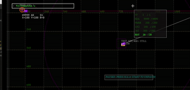

# advanced go: reflection-based debug console

In this article, we'll cover how and why to build a fully-featured debug console that allows live editing of a program's state, such as:

## moving around the player, enemies, or UI elements



## live debug watch window of anything in the game state (& modifying it)


and much more.

## 1. Motivation

For the last few months I've been working nearly full-time on my own 2D Game, 'Tactical Tapir', a top-down shooter a-la Nuclear Throne.

some concept art:


some in-game art:


Working with games is a new domain for me: systems are not as isolable as they are in web development or device drivers. In some ways, the questions game development asks are much more subjective: instead of asking "is this code correct?", you ask "does this feel nice?" "Testing" games is very different rather from say, a web server: you have 'squishy', subjective requirements like 'does this feel nice?' or 'is this fun?' rather than 'does this code meet the spec?'. There's no spec for fun, at least as far as I know.

That is, I need to answer questions like this:

- "see if enemies will friendly fire by placing them in each others' line of fire"
- "examine pathfinding by placing enemies in a maze"
- "see how movement feels with different values for speed, acceleration, etc"
- "refill the player's ammo"
- "adjust coloration of fonts for legibility"

To accomplish that, I'll need to be able to quickly and easily:

- spawn an enemy or obstacle
- change player traits (health, movement speed, etc.)
- manipulate the positioning, size, or look of UI elements
- track the state of a variable or group of related variables from frame-to-frame.

This is actually pretty easy in an interpreted language like LUA or Python, but tricky or impossible in a some compiled languages. Luckily, Go's powerful suite of reflection tools makes this possible.

## 2. An (incredibly brief) introduction to game development

Before we get into the console, let's talk about Game development in general and the process that led to me making a console.

A game is a program that runs in a loop. Each update, or `frame`, does the following:

- take player input
- update the state of the game using that input and the previous state
- draw the relevant part of that state to the screen.

That is, our game loop should look like this:

```go
for tick := 0; ; tick++ {
    inputs := input.ThisFrame()
    debugUpdate(game, inputs)
    if err := game.Update(inputs, tick); err != nil {
        log.Fatalf("shutdown: update(): %v")
    }
    if err := game.Draw(screen); err != nil {
        log.Fatalf("shutdown: draw(): %v")
    }
}
```

### 3: Naive cheats

I started by adding individual keyboard-triggered cheats to the game.

We'll use keyboard inputs to trigger the cheats. We don't want the player to trigger them accidentally, so we'll require that they hold down the `shift` and `ctrl` keys while pressing `H` and `A` respectively.

```go
func applyCheats(g *Game, input Inputs) {
    if input.Held[KeyShift] && input.Held[KeyCtrl] {// check for cheats: if no ctrl+shift, no cheats
        if input.JustPressed[KeyA] {
            log.Println("infinite ammo")
            g.Player.Ammo = math.Inf(1)
        }
        if input.JustPressed[KeyH] {
            log.Println("infinite health")
            g.Player.HP = math.Inf(1)
        }
    }
}
```

Which makes our game loop look like this, checking and applying cheats before each update:

```go
func (g *Game) Update(input Inputs) {
for tick := 0; ; tick++ {
    inputs := input.ThisFrame()
    applyCheats(game, inputs)
    debugUpdate(game, inputs)
    if err := game.Update(inputs, tick); err != nil {
        log.Fatalf("shutdown: update(): %v")
    }
    if err := game.Draw(screen); err != nil {
        log.Fatalf("shutdown: draw(): %v")
    }
}
```

This works pretty well. In fact, we can visualize it as a kind of table:
|cheat|key|description|
|---|---|---|
|∞ ammo|`ctrl`+`shift`+`A`|set `State.Player.Ammo` to math.Inf(1)|
|∞ hp|`ctrl`+`shift`+`H`|set `State.Player.HP` to math.Inf(1)|

Which naturally suggests using a map to store the cheats:

```go
var cheats map[Key]struct { 
    description string
    apply func(*Game)
} {
    KeyA: {
        description: "spawn ammo",
        apply: func(g *Game) {
            g.Pickups = append(g.Pickups, AmmoPickup{...})
        },
    },
    KeyH: {
        description: "spawn health",
        apply: func(g *Game) {
            g.Pickups = append(g.Pickups, HealthPickup{...})
        },
    },
}
func applyCheats(g *Game, input Inputs, cheats map[Key]struct {
    description string
    apply func(*Game)
}) {
    if input.Held[KeyShift] && input.Held[KeyCtrl] {// check for cheats: if no ctrl+shift, no cheats
        for key, cheat := range cheats { 
            if input.JustPressed[key]
                log.Println(cheat.description)
                cheat.f(g)
            }
    }
}
```

While this works well for some tasks, a few limitations are immediately apparent:

- Every new field we touch requires it's own function, even if we have multiple fields that are logically related.
- Those functions must be niladic: that is, they don't take any arguments, they just modify the gamestate directly.
- So for each field, and for each value we want to set it to, we need a separate function.

For some things, like 'infinite HP', this is fine. But for other things, like 'exactly 28 HP', this is absurd. You'd either need to write a function for every possible value, or expand the system somehow to take arguments. We need a more general approach.

### 4: A more general approach

The default API for general-purpose inputs is the command line. That is, prompt that takes a line of text, parses it as a command, and executes it.

The TacticalTapir console has two layers: the terminal, which takes user input and translates it into lines of text, and the shell, which parses those lines of text into commands and executes them.

That is, every frame, we'll `UpdateTerm()` until the user hits enter, then we'll `ParseCommand()` and `Exec()` that command, updating the gamestate as necessary.

Additionally, every frame, we'll `UpdateState` based off of the current gamestate and preivious `Commands`.

Additionally, we'd like to generate completions for the user as they type - we'll get to that later.

```go
// A debug console that allows you to inspect and modify the game state at runtime.
// It's accessed by pressing ~ (shift+`).
// Create one with New(), passing in a pointer to the root of the struct you want to inspect. Call Update() every frame with a pointer to the same value and the current input.Keys
// to see if you got a *Command, then Exec() it to modify the gamestate.
type Console struct {
    State       // State of the game modified or watched by the console.
    Terminal    // Terminal state: input, history, etc; never touches the game state.
    Completions // Possible completions for the current line.
}
```

### Terminal

A basic terminal includes the following navigational features:

| key(s) | description | gif
| --- | --- | ---|
| `'a'..'z'` or other printable characters | insert the character at the cursor | 
| `←` and `→` | move the cursor left and right | 
| `⇧` + `←`, `⇧` + `→` | move the cursor left and right a word | 
| `⌫` | delete the character to the left of the cursor | 
| `⇧` + `⌫` | delete a word to the left of the cursor | 
| `␡` | delete the character to the right of the cursor | 
| `⇧` + `␡` | delete a word to the right of the cursor | 
| `↑` and `↓` | navigate the history, if there is one: they don't wrap. | 
| `⇧` + `↑` and `⇧` + `↓` | go to the start and end of the history. | 
| `⌤` (enter) | submit the current line of text | **SEE BELOW**
| `↹` (tab) | autocomplete the current line of text | 

Working backwards, we'll need to keep track of the following:

- the current line of text
- the cursor position
- the history of previous lines of text
- our last viewed index in the history
- the suggestion for the current line of text, if any.  

Additionally, there are a few gotchas we'd like to avoid:

- We should allow players to hold down a navigational or printable key to repeat it, but without causing unintentional inputs; that is, a reasonable amount of 'debouncing'.
- We'd like to avoid allocating memory for each character the player types.

As a Go struct, this looks like:

```go
// Terminal is the state of the current text input; i.e, the cursor, current line, suggested completion, etc.
// Call CurrentLine(), Cursor(), and SuggestedCompletion() to get read-only views of the current line, cursor position, and suggested completion to
// emulate a terminal for it.
type Terminal struct {
    history     History
    historySave struct {
        time time.Time
        prev History
        sync.Mutex
    }

    curLine              string    // current line of (normalized) input. View from outside with CurrentLine()
    curLineRunes         []rune    // runes to append to curLine: reusable buffer to avoid  extra allocations
    cursor               int       // c.cursor position in curLine. View from outside with Cursor().
    lastNavigationRepeat time.Time // time of last navigation repeat

    suggestedCompletion string // suggested completion for curLine. View from outside with SuggestedCompletion().
}
```

Each frame, we'll `UpdateTerm(&term, keys)` with the state of the terminal and the current input, and `DrawTerm` to render it to the screen. (Drawing is outside the scope of this article, though - I hope to get to it soon!)

#### Key API

Before we get to the implementation, let's quickly go over the API for the `input.Keys` type. The [`ebiten.Key`](https://pkg.go.dev/github.com/hajimehoshi/ebiten/v2#Key) type represents a physical key on a 109-key ANSI keyboard, the most common keyboard layout in the US. Other layouts exist, but we're O.K. with dropping the few bonus keys on, say, the JIS layout.

We'd like an API that looks like this:

```go
package input // input/input.go
type Keys struct { /* some fields */ }
// Pressed starting this frame.
func (k Keys) Pressed(ebiten.Key) bool {}
// Released starting this frame
func (k Keys) Released(ebiten.Key) bool {}
// Continuously held down; either pressed this frame or continuing from a previous frame.
func (k Keys) Held(ebiten.Key) bool {}
```

I.E, if on five frames we got the following inputs for the letter 'E':
> 0, 1, 1, 0, 0

The functions would return the following:
| key | held | pressed | released | note
| --- | --- | --- | --- | --- |
| 0 | F| F | F | ground
| 1 | T | T | F | rising edge
| 1 | T | F | F | continuing
| 0 | F | F | T | falling edge
| 0 | F | F | F | ground

But how best to implement this?

The natural approach is to store the state of each key in a map:

```go
type Keys struct { Held, Pressed, Released map[ebiten.Key]bool}
```

This isn't a bad approach, but maps can be a little fiddly to access concurrently, and every access requires a pointer indirection and a hash lookup. We can do better.

Another approach is simply three arrays of bools:

```go
type Keys struct { held, pressed, released [ebiten.KeyMax+1]bool} // +1 because ebiten.KeyMax is the highest key, not the number of keys; I think this is a bug in ebiten.
```

This is straightforward and requires no indirection, using a single byte per key - 327 bytes in total. But we can do better.

Actually, we don't need 324 bits of information, since we can calculate `Held()`, `Pressed()`, and `Released()` by storing the electrical signal (0 or 1) for each key in the current frame and the previous frame and looking for rising and falling edges:

```go
type Keys struct { thisFrame, lastFrame [ebiten.KeyMax+1]bool}
func (k Keys) Pressed(key ebiten.Key) bool {
    return k.thisFrame[key] && !k.lastFrame[key]
}
func (k Keys) Held(key ebiten.Key) bool {
    return k.thisFrame[key]
}
func (k Keys) Released(key ebiten.Key) bool {
    return !k.thisFrame[key] && k.lastFrame[key]
}
```

That knocks us down to 218 bytes, but we can do better. Why store a bool for each key when we can store a single bit? We can use a bitset to store the state of each key by splitting the keys into two groups of 64 bits and do some bit twiddling to access them:

```go
struct Keys {thisFrame, lastFrame struct { low, hi uint64 }}        


func (k Keys) Held(key ebiten.Key) bool {
    // read as: "check whether the key'th bit is set in thisFrame.low"
    if key < 64 { 
        return k.thisFrame.low & (1 << key) != 0
    }
    // read as: "check whether the (key-64)th bit is set in thisFrame.hi"
    key -= 64 
    return k.thisFrame.hi & (1 << key) != 0
}
func (k Keys) Pressed(key ebiten.Key) bool {
    if key < 64 {
        return k.thisFrame.low & (1 << key) != 0 && k.lastFrame.low & (1 << key) == 0
    }

    key -= 64 
    return k.thisFrame.hi & (1 << key) != 0 && k.lastFrame.hi & (1 << key) == 0
}

func (k Keys) Released(key ebiten.Key) bool {
    if key < 64 { 
        return k.thisFrame.low & (1 << key) == 0 && k.lastFrame.low & (1 << key) != 0
    }
    key -= 64 
    return k.thisFrame.hi & (1 << key) == 0 && k.lastFrame.hi & (1 << key) != 0
}
```

With this design, we can store the state of every key on the keyboard in only 32 bytes (or four 64-bit words). This makes the input state small enough to cheaply copy wherever we need it. Additonally, if we ever needed to access it concurrently, we could use atomic operations to do so without any locks!  Additionally, this opens up the possibility of using bit operations to enable or disable 'groups' of keys at once in very few instructions.

OK, that's enough about the input API. Let's get back to updating the terminal.

#### `UpdateTerm()`

The following is an annotated version of the core of `UpdateTerm()`, stripping out some inessential features like clipboard support and saving the history to disk.

```go
// Update the terminal state with the given input. If the user pressed enter, parse the current line and return a *Command.
//
// # cursor:
//
// ← and → move the cursor left and right
//
// ⇧ + ← and ⇧ + → move the cursor left and right a word
//
// # deletion
//
// ⌫ deletes the character to the left of the cursor
//
// ⇧ + ⌫ deletes a word to the left of the cursor
//
// ␡ deletes the character to the right of the cursor
//
// ⇧ + ␡ deletes a word to the right of the cursor
//
// # history:
//
// ↑ and ↓ navigate the history, if there is one: they don't wrap.
//
// ⇧ + ↑ and ⇧ + ↓ go to the start and end of the history.
func UpdateTerm(t *Terminal, keys input.Keys) (cmd *Command, err error) {
    // bounds check the cursor & suggested completion, just in case
    // we forgot to clean up after ourselves last frame

    if !strings.HasPrefix(t.suggestedCompletion, t.curLine) {
        t.suggestedCompletion = ""
    }
    t.cursor = util.Clamp(t.cursor, 0, len(t.curLine))

    // how many navigation keys are pressed? if more than one, we do nothing rather than guess.

    var (
        up, down, left, right, backspace, del bool
        shift                                    = keys.Held(ebiten.KeyShift)
        tab, enter                               = keys.Pressed(ebiten.KeyTab), keys.Pressed(ebiten.KeyEnter)
    )
    if time.Since(t.lastNavigationRepeat) > time.Millisecond*200 {
        up = keys.Pressed(ebiten.KeyUp) || keys.Held(ebiten.KeyUp)
        down = keys.Pressed(ebiten.KeyDown) || keys.Held(ebiten.KeyDown)
        left = keys.Pressed(ebiten.KeyLeft) || keys.Held(ebiten.KeyLeft)
        right = keys.Pressed(ebiten.KeyRight) || keys.Held(ebiten.KeyRight)
        backspace = keys.Pressed(ebiten.KeyBackspace) || keys.Held(ebiten.KeyBackspace)
        del = keys.Pressed(ebiten.KeyDelete) || keys.Held(ebiten.KeyDelete)
    } else {
        up = keys.Pressed(ebiten.KeyUp)
        down = keys.Pressed(ebiten.KeyDown)
        left = keys.Pressed(ebiten.KeyLeft)
        right = keys.Pressed(ebiten.KeyRight)
        backspace = keys.Pressed(ebiten.KeyBackspace)
        del = keys.Pressed(ebiten.KeyDelete)
    }
    // how many navigation keys are pressed? if more than one, we do nothing rather than guess.
    
    /* -- design note --
        this is the most important part of this function, since it massively reduces the number of cases we need to handle. rather than worrying about what to do if the user presses both left and right, or if they both insert a character and delete a character, we just ignore those cases, assuming they're user error or bouncing keys.
        the original design of this function was hundreds of lines longer and distinctly buggier. This is the fourth revision.
    */

    b2i := func(b bool) int { if b { return 1 }; return 0 }
    switch count := b2i(up) + b2i(down) + b2i(left) + b2i(right) + b2i(backspace) + b2i(del) + b2i(tab) + b2i(enter); count {
    default: // more than one key pressed: do nothing
        return nil, nil
    case 0: // no navigation keys pressed: insert characters & adjust cursor position
        t.curLineRunes = ebiten.AppendInputChars(t.curLineRunes[:0])
        t.curLine = normalize(t.curLine[:t.cursor] + string(t.curLineRunes) + t.curLine[t.cursor:])

        // adjust the cursor position for the new character(s)
        t.cursor += len(t.curLineRunes)
        t.cursor = max(t.cursor, 0)
        t.cursor = min(t.cursor, len(t.curLine))
        return
    case 1:
        t.lastNavigationRepeat = time.Now()
    }
    /* -- design note --
        note that we check shift and also !shift. this is technically redundant, but it protects us against ordering bugs, since it means the switch cases are guaranteed to be mutually exclusive.
    */
    switch {
    default: // no navigation to do, like backspace on an empty line
        return nil, nil
    case enter: // execute the current line
        line := t.curLine
        t.curLine, t.cursor = "", 0 // reset the current line
        c, err := ParseCommand(strings.Fields(line))
        if err != nil {
            return nil, err
        }
        // it's a valid command (in form, at least): add it to the history
        const maxHistLen = 64
        if len(t.history.Lines) >= maxHistLen { // trim the history:
            // copy the back half of the history to the front
            copy(t.history.Lines[:len(t.history.Lines)/2], t.history.Lines[len(t.history.Lines)/2:])
            // then truncate the back half
            t.history.Lines = t.history.Lines[:len(t.history.Lines)/2]
        }
        // now there's definitely room in the history
        t.history.Index = len(t.history.Lines) - 1
        t.history.Lines = append(t.history.Lines, line)

        return &c, nil
    case tab && t.suggestedCompletion != "": // autocomplete the current line
        t.curLine = t.suggestedCompletion
        t.cursor = len(t.curLine) // move the cursor to the end of the line
        return nil, nil
    case left && shift: // move cursor left a word
        t.cursor = max(strings.LastIndexAny(t.curLine[:t.cursor], " \n"), 0)
        return nil, nil
    case right && shift: // move cursor right a word
        if i := strings.IndexAny(t.curLine[t.cursor:], " \n"); i >= 0 {
            t.cursor += i + 1
        } else {
            t.cursor = len(t.curLine)
        }
        return nil, nil
    case left && !shift: // move cursor left.
        t.cursor = max(t.cursor-1, 0)
        return nil, nil
    case right && !shift: // move cursor right
        t.cursor = min(t.cursor+1, len(t.curLine))
        return nil, nil
    // --- deletion ---
    case backspace && shift && t.cursor > 0: // delete word to the left
        i := max(strings.LastIndexAny(t.curLine[:t.cursor], " \n"), 0)
        t.curLine = t.curLine[:i] + t.curLine[t.cursor:]
        t.cursor = i
        return nil, nil
    case backspace && !shift && t.cursor > 0: // delete char to the left
        if t.cursor > 0 {
            t.curLine = t.curLine[:t.cursor-1] + t.curLine[t.cursor:]
            t.cursor--
        }
        return nil, nil
    case del && shift && t.cursor < len(t.curLine): // delete word to the right
        i := strings.IndexAny(t.curLine[t.cursor:], " \n")
        if i < 0 {
            i = len(t.curLine)
        } else {
            i += t.cursor
        }
        t.curLine = t.curLine[:t.cursor] + t.curLine[i:]
        return nil, nil

    case del && !shift && t.cursor < len(t.curLine): // delete char to the right
        t.curLine = t.curLine[:t.cursor] + t.curLine[t.cursor+1:]
        return nil, nil

    // --- history navigation ---
    case down && shift: // goto end of history
        t.history.Index = len(t.history.Lines) - 1
        t.curLine, t.cursor = t.history.Lines[t.history.Index], len(t.history.Lines[t.history.Index])
        return nil, nil

    case up && shift: // goto start of history
        t.history.Index = 0
        t.curLine, t.cursor = t.history.Lines[t.history.Index], len(t.history.Lines[t.history.Index])
        return nil, nil
    case up && !shift: // prev line in history
        if t.history.Index--; t.history.Index < 0 {
            t.history.Index = 0
        }
        t.curLine, t.cursor = t.history.Lines[t.history.Index], len(t.history.Lines[t.history.Index])
        return nil, nil
    case down && !shift: // next line in history
        if t.history.Index++; t.history.Index >= len(t.history.Lines) {
            t.history.Index = len(t.history.Lines) - 1
        }
        t.curLine, t.cursor = t.history.Lines[t.history.Index], len(t.history.Lines[t.history.Index])
        return nil, nil
    }
    // unreachable
}
```

### ParseCommand

Our commands will have an `OPCODE` and zero or more `ARGS`. `ARGS` will be literals representing strings or numbers, (e.g. `100`, `hello`)
, `PATH` to fields of the game state, or `AUGOP`s (augmented assignment operators) like `+=` or `*=`.

`PATH`s will only be able to reach exported (i.e, capitalized) fields of the game state, respecting go's usual rules for visibility. In order to make this easier to work with, all commands will be case-insensitive; in fact, we'll lowercase them before parsing. This does allow for some ambiguities that could lead to 'unreachable' fields. If we had `struct S {XY, xy int}`, then `s.xy` would be ambiguous.

I resolve this problem by _not making structs like that_, but it's worth noting this limitation.

|ITEM|description| example
|---|---|---|
|`OPCODE`| specifies a console command | `watch`, `mod`, `cpin`
|`PATH`| a path to a field of the game state. | `player.hp`, `player.pos.x`
|`AUGOP`| an augmented assignment operator. | `+=`, `*=`, `%=`
|`LITERAL`| a literal value, interpreted by the OP | `100`, `hello`

Commands will be of the form: `OP arg1 arg2 ... argN`, but we'll also allow the form `arg1 AUGOP arg2`, which is equivalent to `mod arg1 AUGOP arg2`. (That is, `mod` is implied as the opcode.)

Some example commands:
|op | args | description|
| --- | --- | --- |
| `watch` | `watch player.hp` | add the player's hp to the debug watch window
| `cpin` | `cpin player.hp 100` | "reset the player's HP to 100 every frame, "pinning it" to a constant value.
| `mod` | `mod player.hp = 100` | set the player's hp to 100
| `mod` | `mod player.hp += 100` | add 100 to the player's hp
| `mod` | `player.x /= 2` | halve the player's x position; 'mod' is implied

We'll represent operators as an enum:

```go
type OpCode int16 // operator. hard to imagine needing more than 256 operators, but we'll use 16 bits just in case.
const (
    // Unknown or invalid operator
    Unknown OpCode = iota
    // WATCH adds a field to the debug watch window. Grammar: `watch <path>`
    WATCH
    // CPIN "pins" a field to a constant value, resetting it every frame. Grammar: `cpin <path> <path_or_literal>`
    CPIN
    // MOD modifies a field. Grammar: `mod <path> <augop> <path_or_literal>`, or <path> <augop> <path_or_literal>
    MOD
)
```

Before we get to parsing, we have an important design decision to make: do we represent commands as a single struct regardless of opcode, or as a seperate struct for each command?

A **single struct** would look like this:

```go

type Command struct {
    Op Opcode
    Args []string
}
func Exec[T any](pt *T, Command) (string, error) {
    switch c.Op {
    default:
        return "", fmt.Errorf("unknown opcode %d", c.Op)
    case Watch:
    case Cpin:
    case Mod:
    }
}
```

Wheras a **seperate struct for each command** would look like this:

```go
type Command interface {
    Opcode() Op
    Exec(reflect.Value) (string, error)
}
type Mod struct {
    LHS, AugOp string
    RHS reflect.Value
}
type Watch struct {
    Path string
}
type Cpin struct {
    Path string
    Value reflect.Value
}   
func (c Mod) Opcode() Op { return Mod }
func (c Mod) Exec(v reflect.Value) (string, error) {
    // ...
}
func (c Watch) Opcode() Op { return Watch }
func (c Watch) Exec(v reflect.Value) (string, error) {
    // ...
}
func (c Cpin) Opcode() Op { return Cpin }
func (c Cpin) Exec(v reflect.Value) (string, error) {
    // ...
}

```

- A single struct requires less code, but is 'stringly typed': we can't use the type system to enforce that the arguments to `mod` are a path, an augop, and a path or literal. We'll just have to make sure that `Exec()` does the right thing. As our list of commands grows, this may become more difficult to maintain, since we'll have a "god switch" in `Exec()` that handles all commands.

- A seperate struct for each command requires more code, but allows us to add new commands without touching the existing code. Additionally, once we have a parsed command, we have stronger guarantees about what it contains: we know that a `Mod` command has a `Path`, an `AugOp`, and a `Value`, and we can use the type system to enforce that.

- A third, best option exists, but we can't use it in Go. Languages with sum types (sometimes called "tagged unions" or "enums") could express a `Command` like this:

    ```rust
    // this is rust code: don't worry about it too much.
    enum AugOp { Add, Sub, Mul, Div, Mod, Pow, BitAnd, BitOr, BitXor, BitClear, Shl, Shr }
    enum Command {
        Set(Path, Value),
        Watch(Path),
        Cpin(Path, Value),
        AugAssign(path: Path, op: AugOp, value: Value),
    }
    ```

    This would combine the best of both worlds: we'd have a single type to represent all commands, but we could guarantee the proper structure of each.

Go doesn't have sum types, so **I chose the single struct approach to minimize the total amount of code**.

_Because_ we're not using separate structs, I don't do much validation in ParseCommand: instead, I'll guarantee the bounds when we actually try and execute.

```go
func ParseCommand(fields []string) (Command, error) {

   switch op := strings.ToLower(fields[0]); op {
    default: // unknown opcode
      // is this an augmented assignment operator?
      if len(fields) == 3 && augassignops[fields[1]] != nil { 
          return Command{MOD, fields[1:]}, nil
      }
      return Command{}, fmt.Errorf("unknown operation %q: expected one of %v", op, opNames)
    case "mod":
      if len(fields) != 4 {
         return Command{}, fmt.Errorf("mod: expected 3 args")
      }
      return Command{MOD, fields[1:]}
    case "cpin": // PIN a field to a Constant value
      if len(fields) != 3 {
         return Command{}, fmt.Errorf("cpin expects 2 arguments, got %d", len(fields)-1)
      }
      return Command{Op: CPIN, Key: fields[1], Vals: fields[2:]}, nil
    /* other cases omitted; they're pretty similar. */
   }
}
```

OK, easy enough. Now we get to the hard part: how do we implement `Command.Exec()`? That is, _how do we access and modify arbitrary fields of arbitrary structs at runtime?_

## 4: Reflection

The reflect package allows you to operate on Go values of arbitrary type without knowing what type or types they are ahead of time. Reflect is too big of a subject to cover in detail here. Instead, I'll first show a few examples of what you can do with it, then present a cheatsheet of the most useful types and functions for you to refer to, then we'll get back to the console. If you're completely lost, I recommend reading [the reflect package docs](https://pkg.go.dev/reflect) and [the reflect tutorial](https://blog.golang.org/laws-of-reflection) first. Chapter 12 of [The Go Programming Language](https://www.gopl.io/) by Kernighan & Donovan is also an excellent resource: [see the source code for that chapter's examples here](https://github.com/adonovan/gopl.io/tree/master/ch12).

### examples

First, a few examples to get the idea across.

- #### Get the value of struct fields by name, regardless of type

    ```go
    // https://go.dev/play/p/gh7TMf2-JlE

    var f64type = reflect.TypeOf(0.0)   
    //  get the value of "`X`" and "`Y`" fields of a struct, regardless of what type the struct is, as long as they're both _any_ numeric type, even if X or Y are embedded in another struct.
    func getXY(v reflect.Value) (x, y float64, ok bool) {   
        if v.Type().Kind() != reflect.Struct { // make sure we have a struct
            return 0, 0, false
        }
        // check if v.X or v.Y would be valid expressions at compile time on the type of v
        vx, vy := v.FieldByName("X"), v.FieldByName("Y")

        if !vx.IsValid() || !vy.IsValid() { 
            // they're not, so we can't do it at runtime either
            return 0, 0, false
        }
        // and that f64(v.X) and f64(v.Y) would be valid conversions at compile time
        if !vx.CanConvert(f64type) || !vy.CanConvert(f64type) {
            // they're not, so we can't do it at runtime either
            return 0, 0, false

        }
        // they are: convert them to float64s and return them
        x, y = vx.Convert(f64type).Float(), vy.Convert(f64type).Float()
        return x, y, true
    }
    ```

    IN:

    ```go
    func main() { // https://go.dev/play/p/IiMldZgkEum
        for _, v := range []any{
            &image.Point{1, 2}, // X and Y are `int` in this package!
            &struct{ X, Y float64 }{3, 4},
            &struct{ image.Point }{image.Point{5, 6}}, // embedded fields
        } {
            v := reflect.ValueOf(v).Elem() // get the Value of the pointer
            x, y, _ := getXY(v)            // get the value of the X and Y fields as float64s
            fmt.Printf("%s: %v, %v\n", v.Type(), x, y)
        }
    }
    ```

    OUT:

    ```text
    image.Point: 1, 2
    struct { X float64; Y float64 }: 3, 4
    struct { image.Point }: 5, 6
    ```

- #### Set the value of struct fields by name, regardless of type

    ```go
    // https://go.dev/play/p/gh7TMf2-JlE
    var f64type = reflect.TypeOf(0.0)

    // set the value of the "`X`" and "`Y`" fields of a struct, so long as X and Y are both _any_ numeric type, even if X or Y are embedded in another struct.
    // we could use this to, for example, set the position of an object in a game to the position of the mouse cursor.
    func setXY(v reflect.Value, x, y float64) bool {
        if v.Type().Kind() != reflect.Struct {
            return false // not a struct
        }
        vx, vy := v.FieldByName("X"), v.FieldByName("Y")
        if !vx.IsValid() || !vy.IsValid() {
            return false // no X or Y field
        }
        if !vx.CanSet() || !vy.CanSet() {
            return false // X or Y is unexported, part of an unexported struct, or isn't in an addressable struct
        }
        if !f64type.ConvertibleTo(vx.Type()) || !f64type.ConvertibleTo(vy.Type()) {
        return false
        }
        vx.SetFloat(x)
        vy.SetFloat(y)
    }
    ```

#### IN

    ```go
    // https://go.dev/play/p/gh7TMf2-JlE
    func main(){
        for _, v := range []any{
            &image.Point{1, 2}, // X and Y are `int` in this package!
            &struct{ X, Y float64 }{3, 4},
            &struct{ image.Point }{image.Point{5, 6}},
        } {
            v := reflect.ValueOf(v).Elem()                // get the Value of the pointer
            x, y, _ := getXY(v)                           // get the value of the X and Y fields as float64s
            fmt.Printf("%s: %v", v.Type(), v.Interface()) // print the type and the values
            setXY(v, x*10, y*10)                          // set the value of the X and Y fields to 10x their original value
            fmt.Printf("-> %v\n", v.Interface())          // print the type and the values
        }
    }
    ```

    OUT:

    ```text
    image.Point: (1,2)-> (10,20)
    struct { X float64; Y float64 }: {3 4}-> {30 40}
    struct { image.Point }: (5,6)-> (50,60)
    ```

- #### zero out any field of any struct

    ```go
    // zero out the given field of a struct, regardless of the type of struct or field, or whether the field is embedded in another struct.
    func zeroField(v reflect.Value, fieldName string) bool {
    if v.Type().Kind() != reflect.Struct {
            return false // not a struct
        }
        f := v.FieldByName(fieldName)
        if !f.IsValid() {
            return false // no field
        }
        if !f.CanSet() {
            return false // field is unexported, part of an unexported struct, or isn't in an addressable struct
        }
        f.Set(reflect.Zero(f.Type()))
        return true
    }
    ```

    IN:

    ```go
    // https://go.dev/play/p/YO8LmQqqZuJ
    func main() {
    type A struct{ F string }
    var a = A{"foo"}
    fmt.Printf("a: before: %+v\n", a)
    zeroField(reflect.ValueOf(&a).Elem(), "F")
    fmt.Printf("a: after: %+v\n", a)

    type B struct{ F int }
    var b = B{2}
    fmt.Printf("b: before: %+v\n", b)
    zeroField(reflect.ValueOf(&b).Elem(), "F")
    fmt.Printf("b: after: %+v\n", b)

    }
    ```

    OUT:

    ```text
    a: before: {F:foo}
    a: after: {F:}
    b: before: {F:2}
    b: after: {F:0}
    ```

### reflect: types and values

Reflect operates on three main types: `reflect.Type`, `reflect.Value`, and `reflect.Kind`. `reflect.Type` represents a type, `reflect.Value` represents a value of that type, and `reflect.Kind` represents the underlying primitive type of a `reflect.Type`; that is, something like `int`, `string`, `struct`, `map`, `slice`, etc.

Get a Value from a normal variable via `reflect.ValueOf(t)`, then modify it with the various functions on `reflect.Value`. Pretty much anything you can do in 'ordinary' go you can do with some combination of `reflect.Value`'s methods. E.g, the following snippets are functionally equivalent:

```go
var n int
reflect.ValueOf(&n).Elem().SetInt(50)
```

```go
func main() {var n int; *(&n) = 50}
```

Or to show it another way:

```go
reflect.ValueOf(&n). // &
Elem(). // *
SetInt(50) // =
```

**Note the pointers**. Since `reflect.ValueOf` is an ordinary function, you'll need to **pass a pointer** if you want to modify one of the arguments, just like any other function.

Find out information about a type via `reflect.TypeOf(t)` or the underlying primitive type via `Type.Kind()`.

In the following notation, eleme `t` is a [`reflect.Type`](https://pkg.go.dev/reflect#Type), `v` is a [`reflect.Value`](https://pkg.go.dev/reflect#Value), `T` and `B` is are types, and `t` and `b` are values of those types (not `reflect.Values`, but the normal type you get via `':='`, `'var'`, etc.

### reflect: cheatsheet

Here's a quick cheatsheet of the types and functions we'll use in this article. Feel free to skip this for now, and come back to it when or if you need it.

#### types

| shorthand | type | obtained via  |
|---|---|---|
|v | [`reflect.Value`](https://pkg.go.dev/reflect#Value) | `reflect.ValueOf("some string")` |
| t | [`reflect.Type`](https://pkg.go.dev/reflect#Type) | `v.Type()` or `reflect.TypeOf("another string")` |
| k | [`reflect.Kind`](https://pkg.go.dev/reflect#Kind) | `t.Kind()` |
| f | [`reflect.StructField`](https://pkg.go.dev/reflect#StructField) | `t.Field()` or `t.FieldByName()` or `t.FieldByNameFunc()`
| n | `int8..=int64` or `int` | `n := 2` |
| b | `bool` | `b := true` |
| s | `string` or `struct` | `s := "some string"`, `s := struct{foo int}{"foo}` |
| m | `map` | `m := map[string]int{"a": 1}` |
| a | `slice` or `array` | `a := []int{1, 2, 3}` |

#### functions

| function | description | example | analogous to
|---|---|---|---|
|[`ValueOf`](https://pkg.go.dev/reflect#ValueOf)| get a [`Value`](https://pkg.go.dev/reflect#Value) from an ordinary value | `reflect.ValueOf(int(2))` | `t := 2` |
|[`TypeOf`](https://pkg.go.dev/reflect#TypeOf)| get a [`Type`](https://pkg.go.dev/reflect#Type) from the value | `t := reflect.TypeOf(int(2))` | `int`|
|[Type.Kind](https://pkg.go.dev/reflect#Type.Kind) | get the underlying primitive type | `t.Kind()` | `int` |
|---|---|---|---|
|[`Type.ConvertibleTo`](https://pkg.go.dev/reflect#Type.ConvertibleTo) | can the type be converted to a different type? | `t.ConvertibleTo(reflect.TypeOf(0))` |
|[`Value.Addr`](https://pkg.go.dev/reflect#Value.Addr) | get the address of a value | `v.Addr()` | `&t` |
|[`Value.CanAddr`](https://pkg.go.dev/reflect#Value.CanAddr) | can the value be addressed? | `v.CanAddr()` | |
|[`Value.CanConvert`](https://pkg.go.dev/reflect#Value.CanConvert) | can the value be converted to a different type? | `v.CanConvert(reflect.TypeOf(0))` ||
|[`Value.Convert`](https://pkg.go.dev/reflect#Value.Convert) | convert a value to a different type | `reflect.ValueOf(&t).Elem().Convert(reflect.TypeOf(b))` | `T(v)` | | use
|[`Value.Elem`](https://pkg.go.dev/reflect#Value.Elem) | dereference a pointer or interface | `v.Elem()` | `*t` | |
|[`Value.Field`](https://pkg.go.dev/reflect#Value.Field) | get the `nth` field of a struct | `v.Field(0)` |
|[`Value.FieldByName`](https://pkg.go.dev/reflect#Value.FieldByName) | for `struct` kinds, get the field with the given name | `v.FieldByName("someField")` | `t.someField`
|[`Value.FieldByNameFunc`](https://pkg.go.dev/reflect#Value.FieldByNameFunc) | for `struct` kinds, get the field with the given name, matching the given predicate | `v.FieldByNameFunc(func(s string) bool { return strings.EqualFold(s, "somefield") })` | `s.someField` or `s.somefield` or `s.Somefield`
|[`Value.Index`](https://pkg.go.dev/reflect#Value.Index) | for `array` and `slice` kinds, get the `nth` element | `v.Index(0)` | `a[0]`
|[`Value.Interface`](https://pkg.go.dev/reflect#Value.Interface)| get an ordinary value back from a `Value` (as `any`) | `reflect.ValueOf(2).Interface().(int)` | `any(int(2)).(int)` |
|[`Value.Len`](https://pkg.go.dev/reflect#Value.Len) | for `array`, `map`, and `slice` kinds, get the length | `v.Len()` | `len(a)`, `len(m)`
|[`Value.MapIndex`](https://pkg.go.dev/reflect#Value.MapIndex) | for `map` kinds, get the value associated with the given key | `v.MapIndex(reflect.ValueOf("someKey"))` | `m["someKey"]`
|[`Value.Set`](https://pkg.go.dev/reflect#Value.Set) | set lhs to rhs, if they're the same `Type` | `v.Set(reflect.ValueOf(2))` | `t = 2` | |  

OK, that covers what we'll need for now. Let's get back to the console.

## 5: Executing commands

In order to execute commands, we'll need to be able to:

- resolve paths to fields of structs, indices of slices or arrays, and values of maps.
- convert values to the correct type
- set the value of a field, index, or map key to a new value.

### 5.1: Resolving paths

We'd like a function which allows us to access any of the subfields of the Game struct, regardless of how deeply nested they are.

That is, we'd like a function like this:

```go
// FollowPath follows a path of '.'-separated keys through a struct, map, or slice, returning the value at the end of the path.
// pointers and interfaces will be continually dereferenced.
func ResolvePath[T any](pt *T, path string) (reflect.Value, error) {}

type Inner struct{ X int }
type Outer struct{ Inner Inner }
type S struct{ Outer Outer }
var s = S{Outer: Outer{Inner: Inner{X: 1}}}
ResolvePath(&s, "outer.inner.x") // like reflect.ValueOf(&s.outer.inner.x).Elem()
```

Additionally, we'd like a single uniform syntax that allows us to access fields of structs, indices of slices or arrays, and values of maps. Taking a cue from `lua`, we'll use `.` as our access operator. All of these should work:

```go
    type S struct{ N int, A []map[string]int }
    func printResolved[T any](pt *T, path string) {
        v, err := ResolvePath(pt, path)
        if err != nil {
            panic(err)
        }
        fmt.Printf("%s: %v\n", path, v.Interface())
    }
    func main() {
        s = S{N: 1, A: []map[string]int{{"a": 1}, {"1", 3}}}
        printResolved(&s, "n") // 1
        printResolved(&s, "a.0") // map[string]int{"0": 3}
        printResolved(&s, "a.0.a") // 1
        printResolved(&s, "a.1.0") // 3: note that 0 is treated as a string here, since that's the type of the keys of the map.
        printResolved(&s, "a.1.-1") // 3: negative indices for slices are treated as python or FORTRAN-style negative indices, where -1 is the last element, -2 is the second-to-last, etc.
    }
```

Let's walk through our implementation of `ResolvePath` step by step. First, we'll need a few helper functions: **derefVal** to dereference pointers and interfaces, and **normalize** to unify our path syntax.

```go
// continually dereference pointers and interfaces until we get a non-pointer, non-interface value.
// panic if we dereference more than 32 times, since this means we've hit some kind of self-referential loop.
func derefVal(v reflect.Value) reflect.Value {
    for i := 0; v.Kind() == reflect.Ptr || v.Kind() == reflect.Interface; i++ {
        v = v.Elem()
        if i > 32 {
            panic("dereferenced 32 pointers, but still got a pointer or interface")
        }
    }
    return v
}

// whitespaceUnifier replaces all whitespace with a single space.
var whitespaceUnifier = strings.NewReplacer("\t", " ", "\n", " ", "\r", " ")    

// normalize normalizes a string by
//  - lowercasing it
//  - replacing all whitespace with a single space
//  - removing leading and trailing whitespace
// warning: given the implementation of normalize, we will not be able to access some string map keys.
// this may not be appropriate for your use case. Again, I solve this problem by "not doing that".
func normalize(s string) string {
    s = strings.ToLower(s)
    s = strings.TrimSpace(s)
    old := s
    for {
        s = whitespaceUnifier.Replace(s)
        if s == old { 
            return s
        }
        old = s
    }
}
```

Our outside-facing API will take the `.`-separated path:

```go
func func ResolvePath[T any](pt *T, path string) (reflect.Value, error) {
    return resolvePath(reflect.ValueOf(pt).Elem(), strings.Split(path, "."))
}
```

And our implementation will step through the path, following each key in turn:

```go
// follow a path of key, case-insensitively, through a struct, map, or slice, returning the value at the end of the path.
// pointers and interfaces will be continually dereferenced.
//
//        type S struct{ F struct { A [3]int } }
//        s := S{F: struct{ [3]int }{[3]int{42, 43, 44}}}
//        v, _ := followPath(reflect.ValueOf(s), "f", "a", "0")
//        fmt.Println(v)
//     Output: 42
func followPath(root reflect.Value, keys ...string) (reflect.Value, error) {
    v := derefVal(root) // will be updated once per loop iteration

    for i, field := range keys { // follow the path: e.g, player.pos.x
        t := v.Type()
        switch k := t.Kind(); k {
        default:
            return v, fmt.Errorf("%s: %v is not a struct, map, slice, or array", root.Type(), strings.Join(keys[:i+1], "."))

        // structs are simple: just get the field by (normalized) name.
        case reflect.Struct:
            v = v.FieldByNameFunc(func(s string) bool { return normalize(s) == field })
            if !v.IsValid() { // field not found
                return v, fmt.Errorf("%s: %v has no field %q", root.Type(), strings.Join(keys[:i+1], "."), field)
            }
        
        case reflect.Slice, reflect.Array:
            // treat the key as an integer index. we use strconv.ParseInt to allow users to use hex, binary, or octal indices if they'd like.
            j64, err := strconv.ParseInt(field, 0, 0)
            j := int(j64)
            if err != nil {
                return v, fmt.Errorf("%s: %v is not a valid index", root.Type(), strings.Join(keys[:i+1], "."))
            }
            if j < 0 {
                j += v.Len() // python-style negative indexing; -1 is the last element, -2 is the second-to-last, etc.
                // but don't allow silly things like -1000 if the slice only has 3 elements.
            }
            if j < 0 || j >= v.Len() {
                return v, fmt.Errorf("%s: index %d out of bounds", root.Type(), j) // out of bounds
            }
            v = v.Index(j)
        }
        case reflect.Map:
            // treat the key as a map key.
            // separate branches for uints, ints, floats, strings.
            // all other types are not supported.

            var key any
            var err error
            // treat theis field as a map key, parsing it as losslessly as possible into the highest-precision numeric Kind we can.
            // i.e, uint8..64 => uint64, int8..64 => int64, float32 => float64, string => string
            switch t.Key().Kind() {
            case reflect.String:
                key, err = field, nil
            case reflect.Int, reflect.Int8, reflect.Int16, reflect.Int32, reflect.Int64:
                key, err = strconv.ParseInt(field, 0, 64)
            case reflect.Uint, reflect.Uint8, reflect.Uint16, reflect.Uint32, reflect.Uint64, reflect.Uintptr:
                key, err = strconv.ParseUint(field, 0, 64)
            case reflect.Float32, reflect.Float64:
                key, err = strconv.ParseFloat(field, 64)
            default:
                err = fmt.Errorf("%s: %v is not a supported map key type", root.Type(), strings.Join(keys[:i+1], "."))
            }
            if err != nil {
                return v, fmt.Errorf("%s: %v is not a valid map key: failed to parse as %v: %w", root.Type(), strings.Join(keys[:i+1], "."), t.Key().Kind(), err)
            }
            // convert the key to actual type of the map's key and use it to index the map.
            // this handles both precision (e.g, uint64 -> uint8) and custom types (e.g, type Celsius float64 -> float64).
            // more about this in the next section.
            key = reflect.ValueOf(key).Convert(t.Key())

            // now index the map
            v = v.MapIndex(key)
    }
    return derefVal(v), nil
}
```

### 5.2: Literals

We'd like all of the following commands to work, without worrying about the type of the fields or the values:
they should "just work":

- `set player.hp 100`
- `set player.hp 100.0`
- `set player.hp player.x`
- `set player.pos npcs.0.pos`

Additionally, we'd like the ability to handle custom types, like colors

#### converting literals

How to handle literals depends on the type of the field we're setting.

- **strings** require no processing.
- **numbers** can be handled like map keys above: parsing as the highest-precision numeric Kind we can, then converting to the actual type of the field, truncating if necessary.
- **bools** can be parsed using `strconv.ParseBool`.
- **other types** can use the `encoding.TextUnmarshaler` interface, which is implemented by many types in the standard library, including `*time.Time` and `net.IP`. A note here: most of the time, these types require a _pointer_ for the method, so we might occasionally need to add a level of indirection to satisfy the interface. **This will have the highest priority**. While it is possible for a type to implement `encoding.TextUnmarshaler` without a pointer receiver (some maps, for example), we will _omit this case_. After all, this console doesn't need to solve _all_ problems, just the problems I have.

Additionally, we'd like to handle one last case - the `color.RGBA` struct is already in use throughout the codebase. I could surround it with a wrapper that implements `encoding.TextUnmarshaler` to make the syntax uniform, or I can special-case an exception. Here, I choose to special-case the exception. I find myself doing this more than once, though, I might consider adding wrappers rather than making the code too complicated.

Let's see what this looks like in code:

```go
// https://go.dev/play/p/KzqjgzF1PhP

// SetString interprets src as a string literal, and attempts to set dst to that value.
// Conversions happen in this order:
// If dst, &dst, *dst, **dst, etc implement encoding.TextUnmarshaler, use UnmarshalText([]byte(src))
// Otherwise, if dst is a string, set it to src.
// Otherwise, if dst is a bool, set it to the result of strconv.ParseBool(src)
// Otherwise, if dst is a numeric type, set it to the result of strconv.ParseFloat(src, 64).
func SetString(dst reflect.Value, src string) error {
    // special cases: do dst, &dst, *dst, **dst, etc implement encoding.TextUnmarshaler?
    if dst.CanAddr() { 
        if x, ok := st.Addr().Interface().(encoding.TextUnmarshaler); ok != nil {
            return x.UnmarshalText([]byte(src))
        }
    }
    // keep dereferencing until we get a non-pointer, non-interface value, trying to satisfy the TextUnmarshaler interface on the way.
    for i := 0; dst.Kind() == reflect.Ptr || dst.Kind() == reflect.Interface; i++ {
        if x, ok := dst.Interface().(encoding.TextUnmarshaler); ok != nil {
            return x.UnmarshalText([]byte(src))
        }
        dst = dst.Elem()
        if i > 32 {
            panic("dereferenced 32 pointers, but still got a pointer or interface: self-referential loop?")
        }
    } 


    /* design note:
    this took a lot of iteration to condense to a reasonable amount of code.
    early designs had separate cases for uint8, uint16, etc.
    later designs converted all numerics to a float64 intermediate, then converted to the final type,
    but I was unsatisfied with the loss of precision and inability to use hex or binary literals (`0xFF`, `0b1010`).
    In this design, we use the ability to assign all of the results of Parse[Bool|Int|Uint|Float] to an `interface{}` (the 'any' type)
    to greatly simplify the code, since Reflect.ValueOf takes an interface{} anyway.
    */


    var x any // value to set dst to
    var err error
    switch dst.Kind() {
    default:
        err = fmt.Errorf("cannot convert %s to %s", src, dst.Type())
    case reflect.String:
        x = src
    case reflect.Bool:
        x, err = strconv.ParseBool(src)
    case reflect.Int, reflect.Int8, reflect.Int16, reflect.Int32, reflect.Int64:
        x, err = strconv.ParseInt(src, 0, dst.Type().Bits())
    case reflect.Uint, reflect.Uint8, reflect.Uint16, reflect.Uint32, reflect.Uint64, reflect.Uintptr:
        x, err = strconv.ParseUint(src, 0, dst.Type().Bits())
    case reflect.Float32, reflect.Float64:
        x, err = strconv.ParseFloat(src, dst.Type().Bits())
    }
    if err != nil {
        return fmt.Errorf("cannot convert %s to %s: %w", src, dst.Type(), err)
    }
    dst.Set(reflect.ValueOf(x).Convert(dst.Type()))
    return nil
}
```

Let's try it out on each of our cases:

```go
func main() {
    // https://go.dev/play/p/TPUf33CWQhT
    ip := new(net.IP) // implements encoding.TextUnmarshaler
    if err := SetString(reflect.ValueOf(ip), "192.168.1.1"); err != nil {
        panic(err)
    }
    fmt.Println(ip) // 192.168.1.1

    n := 0
    if err := SetString(reflect.ValueOf(&n), "22"); err != nil {
        panic(err)
    }
    fmt.Println(n) // 22

    s := "foo"
    if err := SetString(reflect.ValueOf(&s), "somestring"); err != nil {
        panic(err)
    }
    fmt.Println(s) // somestring

    b := false
    if err := SetString(reflect.ValueOf(&b), "true"); err != nil {
        panic(err)
    }
    fmt.Println(b) // true

    c := color.RGBA{} // special case
    if err := SetString(reflect.ValueOf(&c), "0xFF000000"); err != nil {
        panic(err)
    }
    fmt.Println(c)
}
```

OUT:

```text
192.168.1.1
22
somestring
true
{255 0 0 0}
```

Seems good. Let's handle paths.

### 5.3: Converting paths

Paths are slightly more complicated. We need to resolve the path, and then convert the value at the end of the path to the correct type. Unlike literals, we don't want to 'stringly type', but we would like to allow for [go's usual type conversions](https://go.dev/ref/spec#Conversions), such as `int32` to `float64` or `[]byte` to `string`. [`reflect.Value.Convert`](https://pkg.go.dev/reflect#Value.Convert) and [`reflect.Value.CanConvert`](https://pkg.go.dev/reflect#Value.CanConvert) will do this for us.

We've already written `resolvePath`, so let's write a function to convert the value at the end of a path:

```go
// Set the value of dst to the value of src. If src is not convertible to dst, return an error.
func SetVal(dst, src reflect.Value) error {
    dst, src = deref(dst), deref(src)
    if src.ConvertibleTo(dst.Type()) {
        lhs.Set(rhs.Convert(dst.Type()))
        return nil
    }
    return fmt.Errorf("cannot convert %s to %s", src.Type(), dst.Type())
}
```

We can use this to implement the `=` operator:

```go
// set the value at the end of the path to the value of the literal or path.
// litOrSrcPath is always a literal if quoted: otherwise, it's a path.
func set(root reflect.Value, dstPath, litOrSrcPath string) error {
    dst, err := ResolvePath(root, dstPath)
    if err != nil {
        return err
    }
    if strings.HasPrefix(litOrSrcPath, `"`) && strings.HasSuffix(litOrSrcPath, `"`) {
        // definitely a literal. we need to parse it into the correct type.
        // we'll use the type of the lhs as a guide.
        return SetString(dst, litOrSrcPath[1:len(litOrSrcPath)-1])
    }
    // not a literal. maybe it's a path?
    src, pathErr := ResolvePath(root, litOrSrcPath)
    if pathErr == nil {
        return SetVal(dst, src)
    }
    // maybe it's a literal, and thats why we couldn't resolve it as a path?
    if litErr := SetString(dst, litOrSrcPath); litErr != nil {
        // not a literal either
        return fmt.Errorf("set %s %s: %s not a path, and could not be parsed as a literal: %w", dstPath, litOrSrcPath, litErr)
    }

    return SetVal(dst, src)
}
```

### 5.4: Putting it all together

We now have everything we need to execute commands. Let's implement the first command, `MOD`, allowing for operators:

```go
func Exec[T any](pt *T, cmd Command) (description string, err error) {
    defer func() {
        // the console should never panic, even if the command is invalid.
        // if it does, we'll recover and return an error.
        if r := recover(); r != nil {
            err = fmt.Errorf("panic: %v", r)
        }
    }()

    switch c.Op {
    case MOD:
        f, ok := binop[cmd.Args[0]] // a table of functions for each operator: get to this in a second
        if !ok {
            return "", fmt.Errorf("unknown operator %q", cmd.Args[0])
        }
        if cmd.Args[0] == "=" {
            err := set(reflect.ValueOf(pt).Elem(), cmd.Args[1], cmd.Args[2])
            return fmt.Sprintf("set %s = %s", cmd.Args[1], cmd.Args[2]), err
        }
        dst := reflect.ValueOf(pt).Elem()
        /* 
        --- design note: ----
         the choice to use only float64s here loses some precision.
        for integer types. I've gone back and forth on this, but in the end I think this is OK: for integer types <=32 bits it will be 
        exact, and human beings are unlikely to do arithmetic on integers >32 bits in the console.
        still, maybe I'll change my mind later.
        --- 
        */

        // augmented assignment operators only make sense for numeric types. we treat as float64s to simplify implementation.
        rhsVal := reflect.ValueOf(new(float64)).Elem() // addressable float64
        set(rhsVal, "", cmd.Args[2]) // set rhs to the value of the literal or path, converting if necessary.
        rhs := rhsVal.Float()
        var lhs float64
        switch k := dst.Type().Kind(); k {
            default: 
                return "", fmt.Errorf("cannot use augmented assignment operator on %s: kind %s", dst.Type(), k)
            case reflect.Int, reflect.Int8, reflect.Int16, reflect.Int32, reflect.Int64:
                lhs = float64(dst.Int())
            case reflect.Uint, reflect.Uint8, reflect.Uint16, reflect.Uint32, reflect.Uint64, reflect.Uintptr:
                lhs = float64(dst.Uint())
            case reflect.Float32, reflect.Float64:  
                lhs = dst.Float()
        }
        res := f(lhs, rhs)
        SetVal(dst, reflect.ValueOf(res))
    }
}
```

The promised operator table:

```go
var binop = map[string]func(f64, f64) f64{
        "-=": func(a, b f64) f64 { return a - b },
        "*=": func(a, b f64) f64 { return a * b },
        "/=": func(a, b f64) f64 { return a / b },                      // division: div by zero will panic, but that's OK: it will get caught by the panic handler
        "&=": func(a, b f64) f64 { return f64(uint64(a) & uint64(b)) }, // loses some bits of precision
        "%=": func(a, b f64) f64 {
            if a < b {
                return math.Mod(a, b) + b // math.Mod(-1, 8) == -1, but we want 7
            }
            return math.Mod(a, b)
        }, // euclidean mod: not sign-preserving
        "**=": func(a, b f64) f64 { return math.Pow(a, b) },              // exponentiation
        "&^=": func(a, b f64) f64 { return f64(uint64(a) &^ uint64(b)) }, // clear bits, losing some precision
        "^=":  func(a, b f64) f64 { return f64(int(a) ^ int(b)) },        // bitwise xor
        "+=":  func(a, b f64) f64 { return a + b },                       // addition
        "<<=": func(a, b f64) f64 { return f64(int(a) << uint64(b)) },    // sign-preserving left shift
        "=":   func(_, b f64) f64 { return b },                           // assignment
        ">>=": func(a, b f64) f64 { return f64(int(a) >> uint(b)) },      // sign-preserving right shift, losing some precision
        "|=":  func(a, b f64) f64 { return f64(int(a) | int(b)) },        // bitwise or, losing some precision
}
```

We can easily add new commands by adding new cases to the switch statement. `PRINT` seems like an obvious choice:

```go
case PRINT:
    v, err := ResolvePath(reflect.ValueOf(pt).Elem(), cmd.Args[0])
    if err != nil {
        return "", err
    }
    return fmt.Sprintf("%s: %v", cmd.Args[0], v.Interface()), nil
```

And many more exist in the real codebase. Right now, the current list of commands and their usage strings are:

```go
    // examples of each op, printed by the help command.
    examples = validate.MustNonZero("examples", [OP_N][]string{
        CALL:        {"<TODO>"},
        CONCATLOAD:  {`concatload npcs hitsquad`, "concatload walls maze"},
        CPIN:        {`cpin player.HP 9999999`},
        DESTROY:     {"destroy all", "destroy npcs"},
        ENV:         {"env PATH"},
        FLATWATCH:   {`flatwatch player`},
        FOLLOWMOUSE: {"followmouse player", "followmouse ui.watchlist", "followmouse"},
        HELP:        {"help", "help MOD"},
        LIST:        {"list patterns", "list ops", "list saves"},
        LOAD:        {"load player.x player_x.json"},
        MOD:         {`mod player.x *= 10`, `mod player.x -= player.y`, `player.x *= 10`},
        PRINT:       {"print player.x"},
        RESTART:     {"restart"},
        RPIN:        {`rpin player.HP 9999999`},
        SAVE:        {"save player.x player_x.json"},
        SET:         {"set player.x 150"},
        SETMOUSE:    {"setmouse player"},
        TOGGLE:      {"toggle ui.ammo.enabled"},
        UNPIN:       {`unpin player.HP`, `unpin player.HP player.x`, "unpin all"},
        UNWATCH:     {"unwatch"},
        WATCH:       {"watch player.y"},
    })
    // usage strings for each op, printed by the help command.
    usage = validate.MustNonZero("usage", [OP_N]string{
        CALL:        "call <key> [args...]",
        CONCATLOAD:  "concatload <walls|npcs|pickups> file",
        DESTROY:     "destroy pickups|npcs|walls|all",
        ENV:         "env [key]",
        FLATWATCH:   "flatwatch <key> [format]", // todo: recurse into structs to customizable depth???
        HELP:        "help",
        FOLLOWMOUSE: `followmouse [key]`,
        LIST:        "list [patterns|saves|ops]",
        LOAD:        "load <key> <file.json>",
        CPIN:        "cpin <literal>",
        RPIN:        "rpin <key>",
        MOD:         "mod <key> <op> <numeric_lit | key>",
        PRINT:       "print <key> [format]",
        RESTART:     "restart",
        SAVE:        "save <key> <file.json>",
        SET:         "set <key> <value>",
        UNPIN:       "unpin <all> | unpin [key0] [key1] ...",
        SETMOUSE:    "setmouse <key>",
        TOGGLE:      "toggle <key>",
        UNWATCH:     "unwatch",
        WATCH:       "watch <key> [format]",
    })
    // opnames for each op, used for autocomplete and help.
    opNames = validate.MustNonZero("opnames", [OP_N]string{
        CALL:        "call",
        DESTROY:     "destroy",
        ENV:         "env",
        CONCATLOAD:  "concatload",
        FLATWATCH:   "flatwatch",
        FOLLOWMOUSE: "followmouse",
        HELP:        "help",
        LIST:        "list",
        LOAD:        "load",
        CPIN:        "cpin",
        RPIN:        "rpin",
        TOGGLE:      "toggle",
        MOD:         "mod",
        PRINT:       "print",
        SAVE:        "save",
        RESTART:     "restart",
        UNPIN:       "unpin",
        SET:         "set",
        SETMOUSE:    "setmouse",
        UNWATCH:     "unwatch",
        WATCH:       "watch",
    })
```

[see a previous article, go quirks & tricks pt 3, for more info on validate.MustNonZero](https://eblog.fly.dev/quirks3.html)

## 6.0 - Conclusion, and what's next

This covers the basics of how to build a console

There's still plenty more to cover, like

- `followmouse`: a command that allows you to 'drag' any UI element, enemy, or object around the screen with your mouse.
- `flatwatch`: a live debug window
- autocomplete & history in more detail

And I'd love to go into the tradeoffs of alternative designs, like embedding a `LUA` interpreter instead.

But this article is more than long enough already (pushing nearly 10000 words!). I'll save those for next time.

Like this article? Need help making great software, or just want to save a couple hundred thousand dollars on your cloud bill? Hire me, or bring me in to consult. Professional enquiries at
[efron.dev@gmail.com](efron.dev@gmail.com) or [linkedin](https://www.linkedin.com/in/efronlicht)

### bonus: combining reflect and unsafe for true arbitrary modification

The `reflect` package tries only to expose operations that are valid in 'normal' go. Normal rules about type-safety and visibility are respected where possible. Sometimes you need to do something drastic, like directly modify an unexported field or field of unexported (possibly unknown) type!

_Any addressable value of known size_ (that is, native go values with a known location in memory) can be set to an arbitrary byte pattern at runtime. Please do not do this unless you are _absolutely sure_ you both

- know what you're doing
- have no or only very bad alternatives

The basic idea is this: we use the tools of `reflect` to find the address of the field we want to modify. We then convert both that address (the "destination" address) to byte slices of equal length using `unsafe.Slice`. We then do a raw `copy` of the bytes from the source to the destination.

This doesn't so much subvert Go's type system as break it over its knee. It is **your job** to maintain all the invariants of the type system. You won't even get friendly panics if you mess up: at _best_ you'll get a segfault: at worst, anything could happen.

Let's demonstrate:

```go
// https://go.dev/play/p/eZLxNfFBfeV
func main() {
    var s S
    func() { // this guy panics as follows:
        // reflect: reflect.Value.SetInt using value obtained using unexported field
        defer func() {
            if r := recover(); r != nil {
                log.Println(r)
            }
        }()
        reflect.ValueOf(&s).Elem().FieldByName("n").SetInt(2)

    }()
    fmt.Println(s)
    // but this does not:
    src := 2
    dst := reflect.ValueOf(&s).Elem().FieldByName("n")
    copy(
        // take the address of the source: reinterpret it as a slice
        unsafe.Slice((*byte)(dst.Addr().UnsafePointer()), dst.Type().Size()),
        // take the address of the source: reinterpret it
        unsafe.Slice((*byte)(unsafe.Pointer(&src)), unsafe.Sizeof(src)), //
    )
    fmt.Println(s)

}
```

We can restate this as a general-purpose function, using generics to make sure our _source_ at least is an addressable value of known size and protecting ourselves against size mismatches:

```go
// https://go.dev/play/p/eZLxNfFBfeV

// SetUnsafe sets the value of dst to the value of src, without obeying the usual rules about
// type conversions, field & type visibility, etc. Go wild.
// dst must be an addressable Value with a type that is the same size as src.
func SetUnsafe[T any](dst reflect.Value, src *T) {
    size := unsafe.Sizeof(*src)
    if size != dst.Type().Size() {
        panic(fmt.Sprintf("cannot set %v (size %d) to %v (size %d)", src, size, dst.Type(), dst.Type().Size()))
    }
    copy(
        unsafe.Slice((*byte)(dst.Addr().UnsafePointer()), int(size)),
        unsafe.Slice((*byte)(unsafe.Pointer(src)), int(size)),
    )
}
```

What if we already have a slice of bytes? That's simpler: just omit the mainpulation of `src`:

```go
// https://go.dev/play/p/eZLxNfFBfeV

// SetUnsafeBytes sets the value of dst to the value of src, without obeying the usual rules about type conversions, field & type visibility, etc. 
// dst must be an addressable Value with a type that is the same size as the length of src (but it DOESN'T have to be conventionally settable).
//len(src) must be equal to the size of dst, or it will panic.
func SetUnsafeBytes(dst reflect.Value, src []byte) {
    if uintptr(len(src)) != dst.Type().Size() {
        panic(fmt.Sprintf("cannot set %v (size %d) via slice of len %d", dst.Type(), dst.Type().Size(), len(src)))
    }
    copy(
        unsafe.Slice((*byte)(dst.Addr().UnsafePointer()), len(src)),
        src,
    )
}
```

There's one last corner case I want to mention: suppose `src` is a `reflect.Value` already? If src is addressable, we can just use the same technique on `src` as we do on `dst`: if it's not, we'll have to copy `src` to a temporary value which _is_ addressable. See example:

```go
func SetUnsafeValue(dst, src reflect.Value) {
// https://go.dev/play/p/eZLxNfFBfeV
    if src.Type().Size() != dst.Type().Size() {
        panic(fmt.Sprintf("cannot set %v (size %d) to %v (size %d)", src, src.Type().Size(), dst.Type(), dst.Type().Size()))
    }
    if !src.CanAddr() {
        // we can't take the address of src, so we'll have to copy it to something which _is_ addressable.
        src2 := reflect.New(src.Type()).Elem() // reflect.New creates a pointer to a new zero value of the given type... so it's elem is addressable.
        src2.Set(src) // we can safely set the value of src2 to the value of src, since they're the same type.
        src = src2  // and now src is addressable.
    }
    // nothing we can do about dst not being addressable, though: we'll simply panic.
    copy(
        unsafe.Slice((*byte)(dst.Addr().UnsafePointer()), int(dst.Type().Size())),
        unsafe.Slice((*byte)(src.Addr().UnsafePointer()), int(src.Type().Size())),
    )
}
// SetUnsafe sets the value of dst to the value of src, without obeying the usual rules about
// type conversions, field & type visibility, etc. Go wild.
// dst must be an addressable Value with a type that is the same size as src.
func SetUnsafe[T any](dst reflect.Value, src *T) {
    size := unsafe.Sizeof(*src)
    if size != dst.Type().Size() {
        panic(fmt.Sprintf("cannot set %v (size %d) to %v (size %d)", src, size, dst.Type(), dst.Type().Size()))
    }
    copy(
        unsafe.Slice((*byte)(dst.Addr().UnsafePointer()), int(size)),
        unsafe.Slice((*byte)(unsafe.Pointer(src)), int(size)),
    )
}

// SetUnsafeBytes sets the value of dst to the value of src, without obeying the usual rules about type conversions, field & type visibility, etc. 
// dst must be an addressable Value with a type that is the same size as the length of src (but it DOESN'T have to be conventionally settable).
//len(src) must be equal to the size of dst, or it will panic.
func SetUnsafeBytes(dst reflect.Value, src []byte) {
    if uintptr(len(src)) != dst.Type().Size() {
        panic(fmt.Sprintf("cannot set %v (size %d) via slice of len %d", dst.Type(), dst.Type().Size(), len(src)))
    }
    copy(
        unsafe.Slice((*byte)(dst.Addr().UnsafePointer()), len(src)),
        src,
    )

}
```
