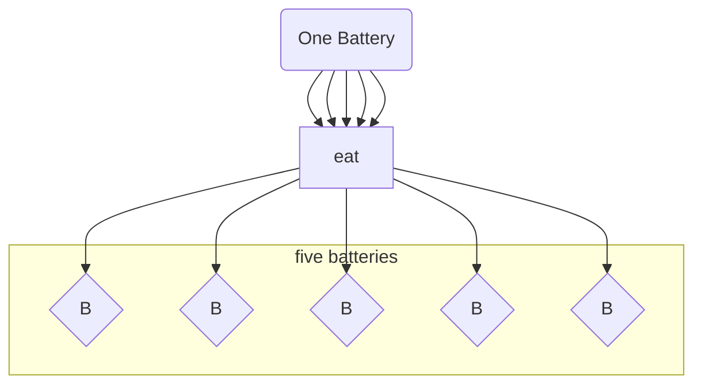

# mermaid test

```mermaid
graph TD
   accTitle: eating one battery
   accDescr: eating five batteries
   A(One Battery) 
    A --> eat --> B0
   A --> eat --> B1
   A --> eat --> B2
   A--> eat --> B3
   A --> eat --> B4
   
subgraph five batteries
   B0{B}
   B1{B}
   B2{B}
   B3{B}
   B4{B}
end
```
