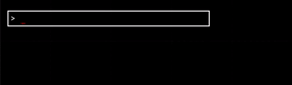

THIS IS UNFINISHED AND UNPUBLISHED.
READ AT YOUR OWN RISK.

# reflect

A software article by Efron Licht
July 2023

## Our goals

Arbitrary manipulation of gamestate at runtime with a forgiving API. Ideally, the combination of console and other debug tools should mean there's no difference between 'playing' the game and 'building/debugging' the game.

High-level goals:

- modify arbitray gamestate at runtime
  - change variables
  - call functions, both built-in to the console or available by walking the gamestate DAG
- UI is also gamestate
  - modify UI live
  - connect variables to player input (mouse position, keyboard input, etc)
Maybe it's easiest if I demonstrate.


## performance

'idle' performance should be as close to zero as possible. The console should not affect performance unless it is being used.

the console should start up _instantly_ and not affect the game's startup time: hard max of 5ms. doing a eager-nonblocking load and not letting the console open on the first frame is totally fine.

Commands should be reasonably performant. 


- 
What does 'reasonably performant' mean in the context of a console?


OTOH, any 'callback' behavior that triggers on gamestate changes should be as fast as possible, since it can be triggered arbitrarily often. it is OK for debugging tools to update less often than the game does: the console should NEVER drop a frame except immediately after processing a new command.

## example uses of the console

## modify UI live

## 'cheat codes': 
- player.hp = 1000000
## change gun defintions live for NPCs and players

### enable or disable UI elements

- toggle ui.healthbar

## connect variables to player input (mouse position, keyboard input, etc)

- `followmouse ui.healthbar`
- `followmouse player`

|symbol|name|unicode|
|---|---|---|
|↑|up arrow|U+2191|
|↓|down arrow|U+2193|
|←|left arrow|U+2190|
|→|right arrow|U+2192|
|⇧|shift|U+21E7|
|⌃|control|U+2303|

### console UI

traditional console UI: command history, autocomplete, etc. history is saved to disk.

|mod|keys|action|note|
|---|---|---|---|
||`↑/↓`|scroll through command history|
||`tab`|autocomplete|
||`←/→`|move cursor|
||`␈`|backspace|
|`⇧`| `←/→`|move cursor by word|
|`⌃`|`←/→`|move cursor to beginning/end of line|
|`⇧`|`␈`|delete word|
|`⌃`|`␈`|delete line|
|`⌃`|`c`| copy line to system keyboard|
|`⌃`|`v`| paste line to system keyboard|
/*
	ALIAS Op = iota // alias a key to another key
	CALL            // call a function
	ENV             // print environment variables
	CPIN            // Pin a value to a constant literal
	RPIN            // Pin a value to reference another key. if self-referential, it will 'freeze' the value.
	// TODO: OPIN? pin with operator, like "pin player.X npc[0].X + 20"
	TOGGLE      // toggle a boolean value
	FOLLOWMOUSE // set a value to follow the mouse position until followmouse is called again
	FLATWATCH   // watch all the values within a struct or field for changes
	HELP        // print help
	LIST        // list possible operations
	LOAD        // load a value from a file. only '.json' for now.
	MOD         // modify a value using an operator
	PRINT       // print a value
	SAVE        // save a value to a file. only '.json' for now.
	CONCATLOAD  // load a value from a file and concatenate it with the current valueg
	DESTROY     // destroy NPCS, WALLS, PROJECTILES, PICKUPS, or ALL of them
	RESTART     // restart the game
	SET         // set a value
	SETMOUSE    // set a value to the mouse position
	UNALIAS     // unbind all aliases
	UNWATCH     // stop watching all values
	UNPIN       // unpin one or more values
	WATCH       // watch a value for changes
	OP_N        // number of operations: must be last
  */
### console commands

|command | description | example | notes |
|---|---|---|---|
`ALIAS` | create an alias for a command | `alias px player.x` | `px` will be expanded to `player.x` |
`CALL` | call a method or function field | `call player.refillhp` | set the player's hp to it's normal max |
`CPIN` | pin a value to a constant literal | `cpin player.x 100` | `player.x` will always be 100 |
`RPIN` | pin a value to reference another key | `rpin player.x player.y` | `player.x` will always be the same as `player.y` |
`TOGGLE` | toggle a boolean value | `toggle ui.healthbar` |  |
`FOLLOWMOUSE` | set a value to follow the mouse position until followmouse is called again | `followmouse ui.healthbar` | healthbar follows the mouse |
`FLATWATCH` | watch all the values within a struct or field for changes | `flatwatch player` | watch all the values within `player` (`player.hp`, `player.x`, `player.y`, etc) for changes |
`HELP` | print help | `help` |  |
`LIST` | list patterns, ops, or saves | `list ops` | list all the operations |
`LOAD` | load a value from a file | `load player player.json` | load `player` from `player.json` |
`MOD` | modify a value using an operator | `mod player.x += 20` | |
`PRINT` | print a value | `print player.x` | |
`SAVE` | save a value to a file | `save player player.json` | save `player` to `player.json` |
`DESTROY` | destroy NPCs, walls, projectiles, pickups, or all of them | `destroy npcs` | destroy all NPCs |
`RESTART` | restart the game | `restart` |  |
`SET` | set a value | `set player.x 100` |  |
`SETMOUSE` | set a value to the mouse position | `setmouse player.x` | set `player.x` to the mouse position |
`UNALIAS` | unbind all aliases | `unalias` | unbind all aliases |
`UNWATCH` | stop watching all values | `unwatch` | stop watching all values |
`UNPIN` | unpin one or more values | `unpin player.x` | unpin `player.x` |
`WATCH` | watch a value for changes | `watch player.x` | watch `player.x` for changes |

### forgiving API

- console should never break the game entirely: all changes should be caught by `reset` at very least
- panics are caught and logged: console should never crash the game
- 
- no worrying about capitalization: unexported fields should be invisible
  - warn on name conflicts at runtime 
- autocomplete should suggest fields and methods
- easy access to array and slice fields
  - combine LUA-like and Python-like index syntax:
  - `npcs.0` <==> `npcs[0]`
  - `npcs.-1` <==> `npcs[len(npcs)-1]`
  - can go back and forth between struct-like, map-like, and array-like access:
    suppose `npcs = []struct{foo map[string]int}: npcs.0.foo.bar <==>`npcs[0].foo["bar"]`
  - user should not have to consider pointer vs value, slice vs array
  - automatic type coersions
    - numbers: use c-like rules, casting to the widest type to do math and then truncating back to the original type. numerical error, etc, is OK: this is meant for debugging, not truth.
    - cast strings to and from other types as needed: other types can be ad-hoc made from strings via TextUnmarshaler
- prefer `toggle ui.healthbar` over `ui.healthbar.enabled = !ui.healthbar.enabled`
- prefer `followmouse ui.healthbar` over `follow(ui.healthbar, mouse)`
- automatically handle pointer ref/deref where possible: console should have no idea what a pointer is: everything should be OK for [`reflect.Value.CanAddr()`](https://pkg.go.dev/reflect#Value.CanAddr).


### implementing the console

#### building autocomplete

CLIs without autocomplete are a pain to use. Autocomplete not only saves on typing, it helps a user discover what commands are available.




We'd like to have a variety of autocompletes available depending on what kind of operation the player is attempting.

For example, for the FIRST word in a prompt, we might want to suggest operations and fields, since all of the following are valid operations:

```sh
tog
```

```sh
```
  
```sh
player.x *= 2 # first word is a field, for a 'modify-in-place' operation
```
We also might want to suggest known savefiles for the `load` and `save` operations, like this:


```go

type completions struct {
  ops    []string
  fields []string
  aliases 
}
func suggestedCompletion(line string, cursor int) string {
// find completions
		if cursor < len(line) {
      return "" // cursor is in the middle of a line: no suggestions
		} 
  
    // what word are we completing?
    i := strings.IndexAny(line, " \t\n") // position of first whitespace, if any
    for i+1 < len(line) && (line[i+1] == ' ' || line[i+1] == '\t') {
      i++ // skip whitespace
    }
    j := strings.LastIndexAny(line, " \t\n\r") // position of last whitespace, if any

    switch {
    case i == -1: // first word: choose an op or field. ops take priority.
      if completion := autocomplete(c.completions.ops, line); completion != "" {
        return completion
      }
        c.suggestedCompletion = autocomplete(c.completions.fields, line)
      }
    case i == j: // second word: choose a field
      return line[:i+1] + autocomplete(c.completions.fields, strings.TrimSpace(line[i+1:]))
    case strings.Contains(line, "save"),
      strings.Contains(line, "load"): // third word during 'save' or 'load': choose a file
      return line[:j+1] + autocomplete(c.saveFiles, line[j+1:])
    default: // third word, not during 'save' or 'load': choose a field, like for 'player.x += player.y'
      return line[:j+1] + autocomplete(c.completions.fields, line[j+1:])
    }
}
```